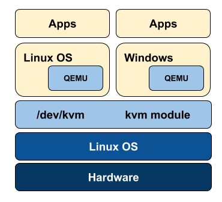

# KVM

# KVM ( 커널 기반 가상 머신)

은 가상화 확장이 포함된 x86 하드웨어의 Linux용 전체 가상화 솔루션.

 

[KVM 가상 머신 관리 도구](https://www.notion.so/7408ef5892a4474381896fa2f24dc33f)

### Qemu 와 KVM

KVM은 리눅스 커널기반의 HVM 방식을 지원하는 하이퍼바이저로 유저 영역에서 가상화 기능을 사용할 수 있다. KVM을 위해서는 애물레이션이 필요한데, Qemu를 사용하고 있다. KVM의 가장 중요한 구성요소라고 할 수 있다. 커널 2.6.20 부터 리눅스 커널에 포함됐다. KVM을 한다는 것은 Qemu를 한다는 것과 동일하다.

### 리눅스 KVM과 Qemu

리눅스는 KVM이라는 커널레벨의 가상화 환경을 지원한다. 원래는 커널 패치형태로 지원이 됐는데, 2.6.20 버전부터 정식으로 커널에 포함됐으며, 공식 리눅스 패키지의 일부로 제공되고 있다. KVM은 Qemu를 기반으로 구현돼 있다.

[https://www.oss.kr/storage/app/public/oss/9c/82/[KVM] Solution Guide V0.95.pdf](https://www.oss.kr/storage/app/public/oss/9c/82/%5BKVM%5D%20Solution%20Guide%20V0.95.pdf)

[https://jiming.tistory.com/250](https://jiming.tistory.com/250)
